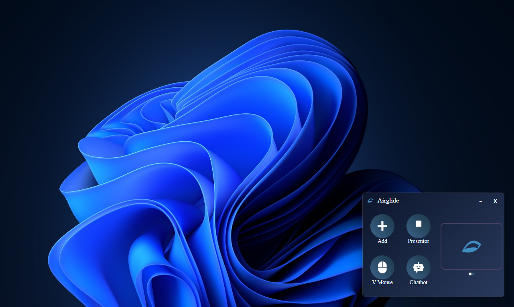
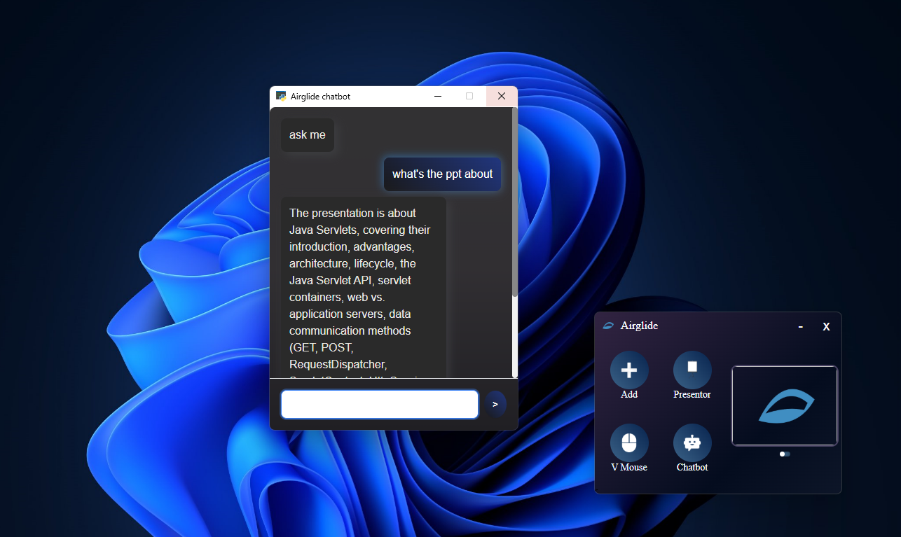

# Airglide 

Airglide is a **gesture-controlled presentation software** built with **Python (backend)** and **HTML/CSS/JS (frontend)** via **with using multiple libraries -opencv,medipipe,pyvebview etc**.  
It lets you **control PowerPoint presentations with hand gestures**, use a **virtual mouse**, and interact with an **AI-powered chatbot** — all inside a sleek desktop app.

-> Currently works on **Windows only**.

---

##  Features

### 1️ Add PPT Dynamically
- Upload a `.ppt` file directly inside the app.
- If a new file is added, the old one is automatically replaced.

### 2️ Presentation Mode (Presentor)
- Opens the uploaded PPT along with the **camera**.
- Control your slides with **hand gestures**:
  -  Next / Previous slide
  -  Jump to **first** slide
  -  Jump to **last** slide
  -  Enable/Disable pointer
  -  Increase / Decrease volume

### 3️ Virtual Mouse
- Use **hand gestures** to move the mouse cursor.
- No need for physical mouse during your presentation.
- index finger to move the mouse and index + middle simultaneously to double click

### 4️ AI Chatbot 
- Ask **questions related to your uploaded PPT**.
- If the question is irrelevant → chatbot replies with *invalid question*.

### 5️ Camera Toggle
- A toggle button in the UI lets you:
  -  Open a mini camera window (adjust camera angles)
  -  Hide it when not needed

---

##  Screenshots

**Main Interface**  

---

##  Tech Stack

- **Frontend**: HTML, CSS, JavaScript
- **Backend**: Python (core logic + libraries)
- **UI Framework**: PyWebview

